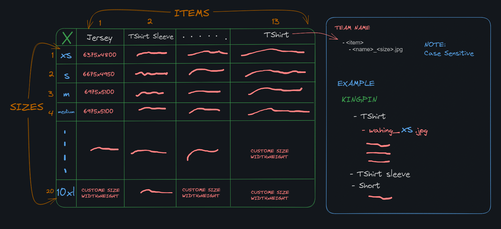
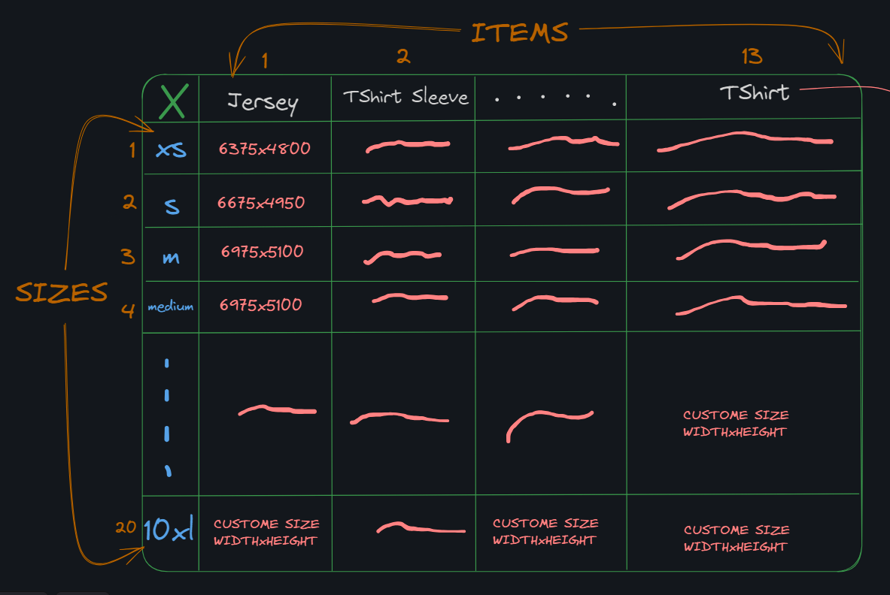

# image-layout-checker
Checks if the images are what is specified in the template
Checks given folder if new image has been resize correctly

##  To build windows
GOOS=windows GOARCH=amd64 go build -o bin/image-layout-checker.exe src/main.go

### Template File
File must be in .csv format and should follow this file formatting

### Foldering format
Folder must follow template to match
