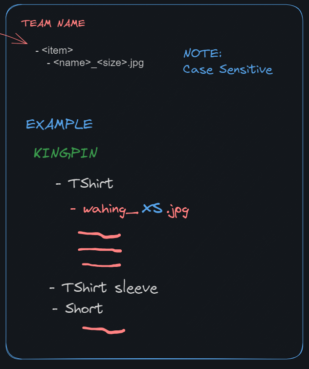

# image-layout-checker
Checks if the images are what is specified in the template
Checks given folder if new image has been resize correctly

##  To Run
go run .

##  To build windows
fyne-cross windows -arch=amd64

### Template File
File must be in .csv format and should follow this file formatting

### Foldering format
Folder must follow template to match
